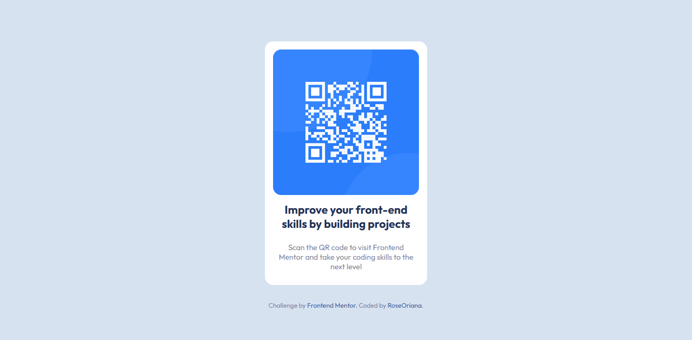

# Frontend Mentor - QR code component

## Preview

## Live Demo

[Deployed Site](https://roseoriana.github.io/FrontendMentor--QR-code-component/)

## Tools

- HTML
- CSS (Flexbox)

## Frontend Mentor -> Introduction

## Welcome! 👋

Thanks for checking out this front-end coding challenge.

[Frontend Mentor](https://www.frontendmentor.io) challenges help you improve your coding skills by building realistic projects.

**To do this challenge, you need a basic understanding of HTML and CSS.**
